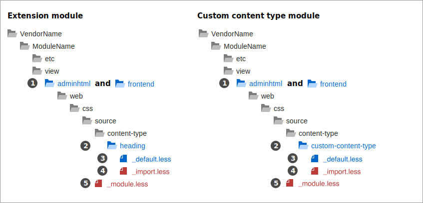

# Use Modules to override styles

When you create a Page Builder module by either extending a Page Builder content type or creating a custom content type, you will override Page Builder styles from within the module. The overriding CSS selector pattern is the same: `#html-body` + `[attribute]` + `any additional selector`, as shown here:

```scss
#html-body [data-content-type='my-custom'].my-class
```


Using this selector pattern makes your module styles easy to override from a theme. In fact, you can use the exact same selectors in your themes because Magento adds theme styles _after_ module styles in the `styles.css` output. Cascading stylesheet rules do the rest. Browsers will apply the _last_ same-specificity CSS selectors (from your theme styles) to your module's content.

## Steps for overriding Admin and frontend styles

The steps for overriding Page Builder styles in the Admin and on the storefront are the same, as are the directory structures for both extension and custom content type modules. The following diagram shows these numbered steps shared between the `areas` and module types.



The steps for overriding styles in your modules are similar to those introduced for [overriding Admin themes](use-themes-to-override-styles.md). They are numbered in the image and described as follows:

### Step 1: Create `adminhtml` and `frontend` directories

In modules, the only difference between overriding Page Builder Admin styles and storefront styles is the location of your `.less` files. Adding your `.less` files to the `adminhtml` directory overrides Page Builder's Admin styles. Adding them to the `frontend` directory overrides Page Builder's storefront styles. All the other guidelines for each `area` are the same.

### Step 2: Add content type directories

To help organize your `.less` files, we recommend using directory names that match the content-type names you want to override. For example, in our `Heading` extension module, we added a `heading` directory. And for our custom content type module, we added a `custom-content-type` directory (assuming that's the name of our custom content type). These subdirectories (including `content-type`) are not required. They simply help organize your stylesheets as your modules grow.

### Step 3: Add `.less` files and styles.

We also recommend naming your `.less` files to match the content-type appearances you are overriding. Our example modules each have only one appearance called `default`. So we added a `_default.less` file to each. However, if we were extending Page Builder's `Row`, we might have three `.less` files named after each `Row` appearance. This naming convention helps you find your overriding styles if you extend or create content types with multiple appearances.

Here's an example style that uses the CSS selector pattern to override Page Builder's `h1` heading tags:

```scss
// CSS specificity = 111
#html-body h1[data-content-type="heading"] {
    font-size: 40px;
    line-height: 61px;
    font-weight: 700;
    margin-bottom: 0;
}
```

To ensure this style overrides the `h1` element of the `Heading` content type within the Admin and on the storefront, you would add it to the `_default.less` files in both the `adminhtml` and `frontend` areas of your module.

### Step 4: Add `_import.less` files

As another organizing practice, we recommend adding `_import.less` files to each content type directory. These files should only contain `@import` statements for all other `.less` files in the directory. When there's only one `.less` file in the directory (as with our example), this practice feels like overkill. But it's a good habit to create as your modules become more complex. Using import files like this helps keep your changes closer to where they occur. In these module examples, the `_import.less` files contain only one import:

```scss
@import '_default.less';
```

### Step 5: Add a `_module.less` file

The `_module.less` file is the only **required** file and must be added directly to the `adminhtml/web/css/source` directory. Magento uses this file to add your content type's Admin styles to the `pub/static/adminhtml` output, where they can override the default content-type styles. Like the `_import.less` files, it's a best practice for your `_module.less` file to contain only `@import` statements. Technically, you could put all your CSS directly in `_module.less`, but that could quickly become a mess. Using best practices, our `_module.less` files in these examples would look like this:

```scss
// Extension module
@import 'content-type/heading/_import.less';

// Custom module
@import 'content-type/custom-content-type/_import.less';
```

## Summary

Overriding the default Page Builder styles within modules is mostly a matter of using the overriding CSS selector patterns and putting them in the right files. To override Page Builder Admin styles, add your styles to right `adminhtml` files. And to override Page Builder storefront styles, add your styles to the right `frontend` files.
